# Guía RWA — Tokenización de Activos del Mundo Real

Ruta de estudio para el taller. Complementa [`02-tokenizacion-conceptos.md`](02-tokenizacion-conceptos.md) y la sección `/conceptos` del frontend.

---

## 1. Fundamentos de RWA

### Ethereum — Real-World Assets

[Ethereum.org — Real-World Assets](https://ethereum.org/es/real-world-assets/)

Buen punto de entrada para entender cómo activos como oro, bienes raíces, acciones, bonos, maquinaria e instrumentos financieros pueden representarse mediante tokens y conectarse con infraestructura blockchain.

---

### Chainlink — Real-World Assets Explained

[Chainlink — Real-World Assets Explained](https://chain.link/education-hub/real-world-assets-rwas-explained)

Ciclo general de tokenización:

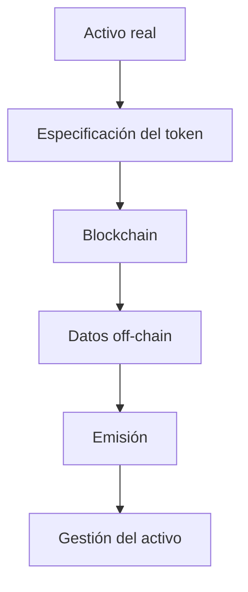

---

## 2. ¿Cómo se tokeniza realmente un activo?

### Chainlink — How to Tokenize an Asset

[How to Tokenize an Asset — Chainlink](https://chain.link/education-hub/how-to-tokenize-an-asset)

Recurso recomendado para pasar de la teoría a una arquitectura técnica. Aborda: tokenización, smart contracts, custodia, oráculos, Proof of Reserve, datos off-chain, emisión y gestión del activo.

### Chainlink — What Is Tokenization?

[What Is Tokenization? — Chainlink](https://chain.link/education-hub/tokenization)

Recurso introductorio para comprender qué significa realmente tokenizar un activo.

---

## 3. Arquitectura de un RWA

Un RWA no debería entenderse simplemente como *Activo → ERC-20*.

Una arquitectura institucional normalmente tiene varias capas:

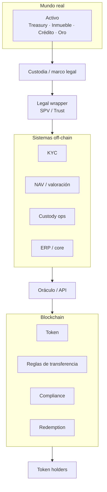

### Lectura recomendada

[A Taxonomy of Real-World Asset Tokenization — 2026](https://arxiv.org/abs/2606.08534)

Analiza gobernanza, estructura del activo, propiedades del token, DLT, economía e interoperabilidad.

Conclusión clave: los RWA suelen ser **arquitecturas híbridas**:

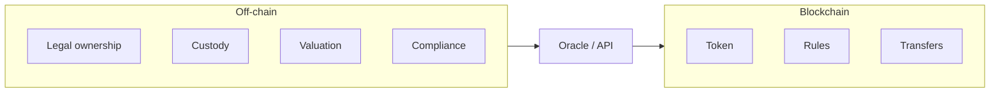

El token no necesariamente “es” el activo físico. Puede representar un **derecho legal o económico** sobre el activo.

---

## 4. Tokenización con Centrifuge

[Centrifuge Docs — Tokenization](https://docs.centrifuge.io/user/concepts/tokenization/)

Implementación orientada a activos reales: US Treasuries, real estate, private credit, consumer finance, carbon assets.

Los tokens pueden incorporar **restricciones de transferencia**:

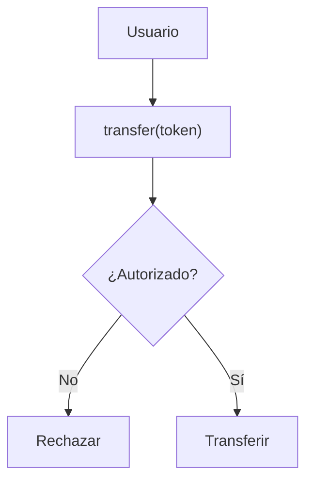

Especialmente relevante para instituciones financieras.

---

## 5. Estándares de tokens

### ERC-20

Fungible. Ejemplo: `1 token = 1 USD`.

```solidity
balanceOf()
transfer()
approve()
transferFrom()
```

### ERC-721

No fungible. Ejemplo: Token `#001` → apartamento específico.

### ERC-1155

Varios tipos de activo en un mismo contrato.

### ERC-3643

Security / permissioned tokens: identidad, compliance, restricciones de transferencia.

Un token RWA institucional necesita más que `transfer()`:

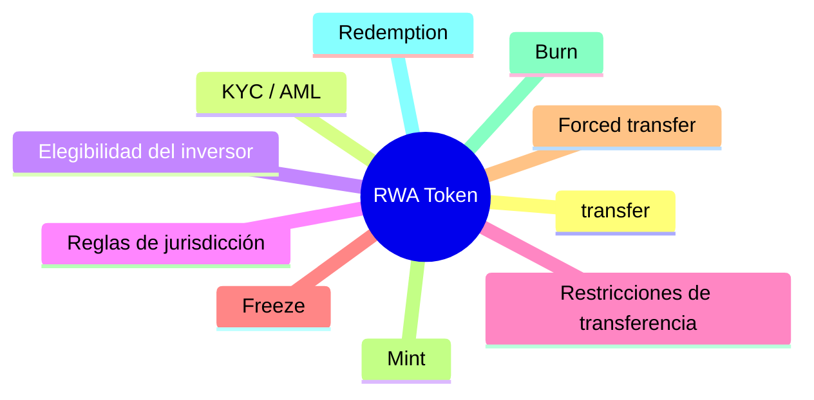

---

## 6. Tutorial práctico

[How to Tokenize a Real-World Asset — Patrick Collins](https://www.youtube.com/watch?v=KNUchSEtQV0)

Solidity, collateral, Chainlink Functions, price feeds, redemption, Proof of Reserve.

Stack posible para una POC:

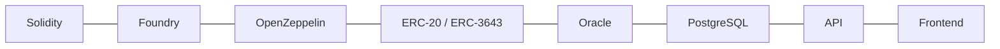

---

## 7. Casos de uso que deberías estudiar

### 7.1 Treasury / bonos

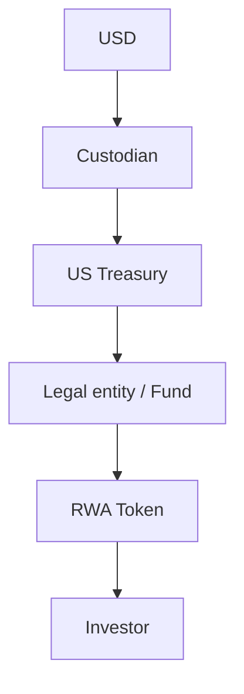

Preguntas: ¿quién es dueño del Treasury? ¿quién custodia? ¿qué representa el token? ¿NAV? ¿intereses? ¿redención?

### 7.2 Private credit

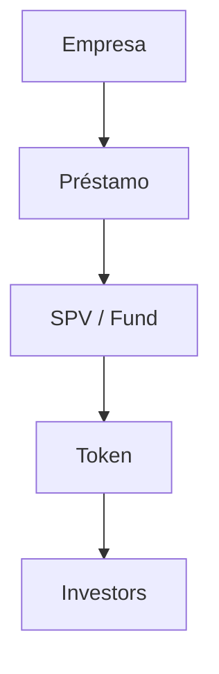

Cash flows, default, valuation, waterfall, seniority, redemption, interest payments.

### 7.3 Real estate

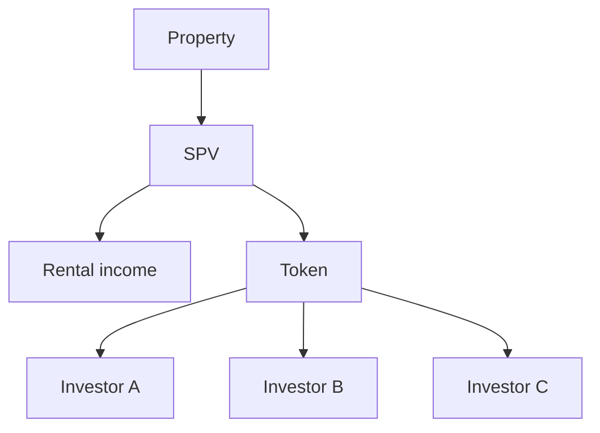

Fractional ownership, rentas, valorización, governance, transfer restrictions, legal ownership.

En la demo del taller, **RENT** ilustra este patrón de forma simplificada (participación económica + rentas proporcionales).

---

## 8. Investigación académica

[SoK of RWA Tokenization — Architectures & Legal Interoperability](https://arxiv.org/abs/2604.06608)

Lifecycle, arquitecturas, custodia, estándares, interoperabilidad legal, oracles, valoración, sovereign debt, private credit, real estate.

Útil para mirar RWA desde **arquitectura empresarial / de solución**.

---

## 9. Ruta de aprendizaje recomendada

| Etapa | Tema | Objetivo |
|---|---|---|
| 1 | RWA Fundamentals | Entender el problema |
| 2 | Asset Tokenization Lifecycle | Entender el proceso |
| 3 | Legal Wrapper / SPV | Qué representa el token |
| 4 | ERC-20 | Token fungible |
| 5 | ERC-3643 | Tokens regulados / permissioned |
| 6 | Oracles | Mundo real ↔ blockchain |
| 7 | Proof of Reserve | Verificar respaldo |
| 8 | Custody | Quién controla el activo |
| 9 | Redemption | Token → activo / valor |
| 10 | Compliance | KYC / AML / transfer restrictions |
| 11 | Secondary Market | Trading |
| 12 | DeFi Integration | Lending / collateral / liquidity |

---

## 10. POC recomendada: tokenización de depósitos

Una POC interesante para banca: **Deposit Token**.

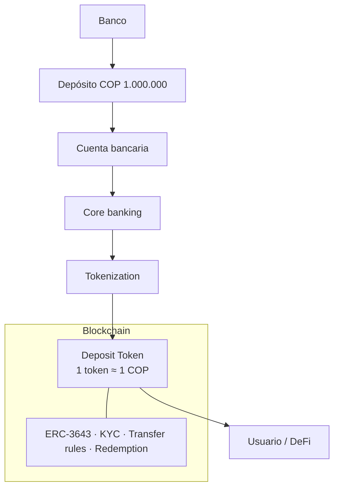

### Componentes de la POC

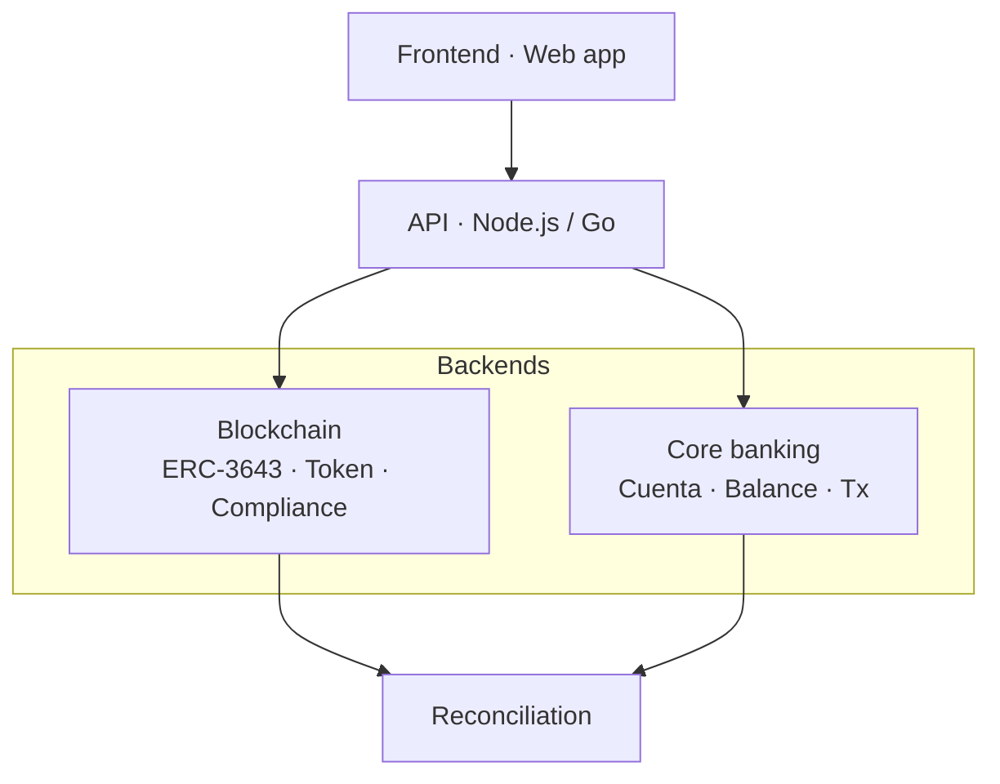

---

## 11. Preguntas importantes de arquitectura

No te quedes solo en *“¿cómo creo el token?”*:

| Dimensión | Pregunta |
|---|---|
| Asset | ¿Qué activo estoy tokenizando? |
| Ownership | ¿Quién es dueño del activo? |
| Legal | ¿Qué derecho representa el token? |
| Custody | ¿Quién custodia el activo? |
| Valuation | ¿Cómo conozco el valor? |
| Oracle | ¿Cómo llega la info del mundo real on-chain? |
| Compliance | ¿Quién puede comprar / mantener / transferir? |
| Redemption | ¿Cómo vuelvo de token a dinero o activo? |
| Settlement | ¿Dónde y cómo ocurre la liquidación? |
| Secondary market | ¿Puede negociarse en secundario? |

---

## 12. Concepto clave

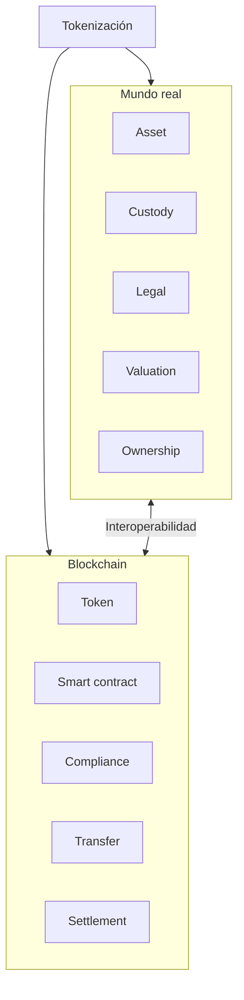

**RWA no es simplemente crear un token.** Es conectar:

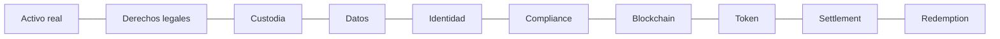

---

## 13. Orden recomendado de estudio

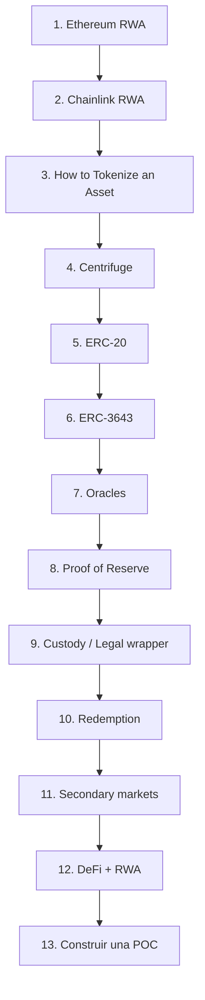

### Objetivo final

Validar el aprendizaje con una POC completa:

> Tokenización de un activo financiero bancario, desde el depósito/activo subyacente hasta la emisión, transferencia, liquidación y redención del token.

Eso cubre **RWA + ERC-3643 + compliance + oráculos + custody + lifecycle + settlement**, más representativo de un escenario institucional que un ERC-20 aislado.

---

## Enlaces del taller

- [`recursos/Enlaces_de_interes.md`](../recursos/Enlaces_de_interes.md)
- Frontend: `/conceptos/guia-rwa` (guía interactiva), `/conceptos/enlaces`
- Demo: `/demo` (flujo RENT en Sepolia)
